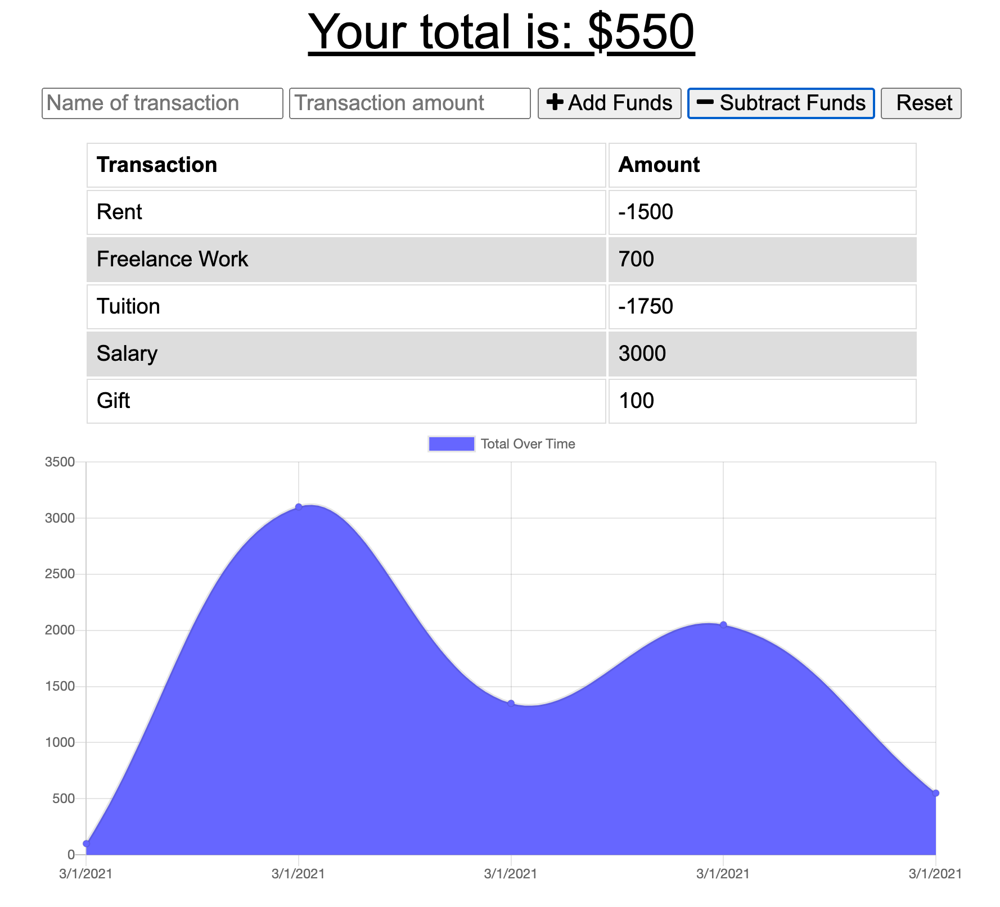
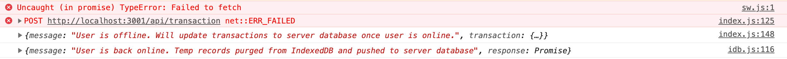

Budget Tracker
====

    

Description
---
By Weng Fei Fung. Budget Tracker lets you record your expenses and deposits so you can track your budget anywhere you are. Even if you are traveling to a remote area where internet is spotty, the app remembers your offline records and updates as soon as the internet is connected. You can install the PWA and have easy access from your mobile's home screen.

Demo
---
.

Screenshot
---
Intuitive Interface

Offline Capable

Table of Contents
---
- [Description](#description)
- [Demo](#demo)
- [Screenshot](#screenshot)
- [Installation](#installation)
- [Tests](#tests)
- [Questions](#questions)

Installation
---
Run `npm install` to download npm modules. Then start express server with `npm run start`. Visit localhost:3001 to begin using. Alternately, you can deploy to a node server like Heroku.

Tests
---
Tests for offline detection and indexedDB are at localhost:3001/test

Questions
---
- Where can I see more of your repositories?
	- Visit [Siphon880gh's Repositories](https://github.com/Siphon880gh)

- Where can I reach you?
	- You can reach me with additional questions at <a href='mailto:weffung@ucdavis.edu'>weffung@ucdavis.edu</a>.
	- Want to [hire me](https://www.linkedin.com/in/weng-fung/)?